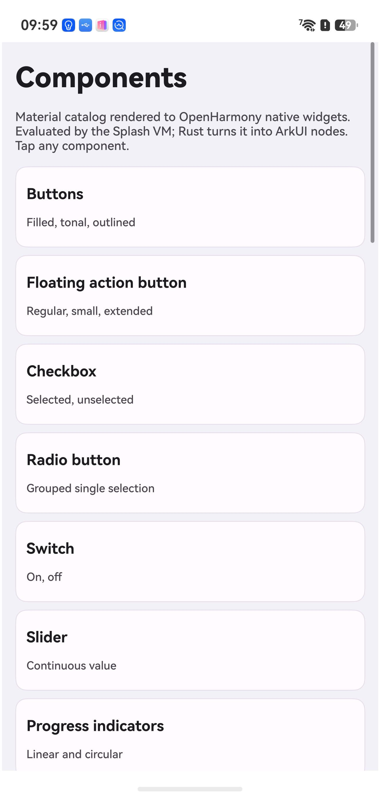

# Splash-OH

Render a UI tree to **OpenHarmony native ArkUI widgets from Rust**, with ArkTS
reduced to a single slot handover — and no makepad renderer involved.




Everything in that screenshot is a real ArkUI component (`ARKUI_NODE_TEXT`,
`ARKUI_NODE_BUTTON`, `TOGGLE`, `CHECKBOX`, `RADIO`, `SLIDER`, `PROGRESS`,
`TEXT_INPUT`, `DATE_PICKER`, `SCROLL`, `COLUMN`, `ROW`, `STACK`) created,
configured and mounted by Rust.

## Why

`octos-one`'s OpenHarmony port drives native widgets by calling ArkTS methods
over napi, and a round trip there measured ~1.05 ms — 70% of it spent waiting
for the JS event loop to pick the work up. One webview rectangle per frame can
survive that. A *widget tree* cannot, if every `View`, `Label` and `Button` pays
it.

So this repo asks whether the JS thread can be removed from the path entirely.
It can — and then it asks what that is actually worth, which turns out to be a
more interesting question than the premise. See
[the measurements](#widget-construction-rust-vs-arkts-measured).

## The one piece of ArkTS

```ts
@Entry @Component struct Index {
  private content: NodeContent = new NodeContent();
  aboutToAppear(): void { splash.mount(this.content); }   // the only ArkTS→native call
  build() { Column() { ContentSlot(this.content) }.width('100%').height('100%') }
}
```

After `mount()` returns, ArkTS is out of the loop. There are no per-widget and
no per-frame ArkTS calls.

## Layout

```
crates/splash-oh/
  build.rs              compiles the shim against the OHOS SDK, links ace_ndk
  src/arkui/shim.cpp    C++ over ArkUI_NativeNodeAPI_1 + compiler-computed enums
  src/arkui/mod.rs      safe Rust: Node, attributes, events, mounting
  src/catalog.rs        the widget catalog
  src/lib.rs            napi entry: NodeContent -> native tree
deveco/                 minimal HAP (one page, one ability)
```

## Build

```bash
source ~/ohos-sdk/env-deveco.sh
export OHOS_SDK_NATIVE="$OHOS_BASE_SDK_HOME/21/native"
cargo build --target aarch64-unknown-linux-ohos --release

cp target/aarch64-unknown-linux-ohos/release/libsplash_oh.so deveco/entry/libs/arm64-v8a/
cd deveco
export DEVECO_SDK_HOME="$DEVECO_HOME/sdk" NODE_HOME="$DEVECO_HOME/tools/node"
node "$DEVECO_HOME/tools/hvigor/bin/hvigorw.js" \
  assembleHap --mode module -p product=default -p buildMode=release --no-daemon
```

The `aarch64-unknown-linux-ohos` target ships in **nightly** only — see
`rust-toolchain.toml`.

## Three traps this repo already walked into

**1. Never hand-write the ArkUI enums.** `ArkUI_NodeAttributeType` is mostly
implicit (`NODE_HEIGHT,` with no `= N`) and the per-component blocks are
`1000 * ARKUI_NODE_X + n`. Transcribed by hand, `NODE_BORDER_WIDTH` came out 14
instead of 17 — which is `NODE_BLUR` — and the app died with
`SIGSEGV(SEGV_MAPERR)`. Parsing the header with a script was no better: implicit
values made the running counter drift (`ARKUI_NODE_COLUMN` → 27, actual 1006).
The fix is in `shim.cpp`: let the **compiler** evaluate them and export the
results as C globals that Rust reads.

**2. The SDK headers only compile as C++.** `native_type.h` uses bare `bool`;
`native_node.h` refers to `OH_PixelmapNative` without a `struct` tag. Both are
hard errors in C. Hence `shim.cpp`, not `shim.c`.

**3. `DEVECO_SDK_HOME` is DevEco's own `sdk/` directory** — not a versioned
symlink farm. Pointing it elsewhere yields `SDK component missing`.

## The DSL drives it

`assets/catalog.splash` **is** the app. The VM evaluates it at runtime and Rust
walks the resulting tree into ArkUI nodes — `fn`s, `for` loops, `while`,
arithmetic and `s.len()` all run on device:

```
fn argb(a, r, g, b) { return ((a * 256 + r) * 256 + g) * 256 + b }
let primary = argb(255, 103, 80, 164)

fn filled_button(label, tap) {
    return {t: "button", label: label, w: CARDW, h: 40, radius: 20,
            margin: 4, bg: primary, color: on_primary, tap: tap}
}

let chips = []
for c in [primary, secondary, tertiary, error, outline] { chips.push(swatch(c)) }
```

A node is `{t: "<type>", ...attrs, c: [children]}`. Plain data rather than
makepad's `Button{...}` component syntax, because that syntax resolves through
makepad's **widget registry** — exactly the coupling this repo avoids.

### Three things the DSL integration cost

- **Arrays are their own heap type.** `c: [...]` is a `ScriptArray`, not an
  object with a vec, so `as_object()` returns None and every subtree silently
  vanished. Use `as_array()` + `array_storage()`.
- **`0xFF6750A4` hex literals evaluate to 0**, which made every colour
  transparent — text and cards rendered invisible while default-coloured
  widgets looked fine. Hence `argb()`.
- **Native ArkUI nodes do not auto-size.** A `Text` with no width measures to
  zero and draws nothing; wrapped text needs its height computed, or it
  overlaps whatever follows.

## Backend mapping

The DSL is renderer-agnostic:
`makepad-script` (the Splash VM, ~52k lines) depends only on `error-log`,
`math`, `live-id`, `smallvec`, `regex` and `html` — **no platform, no draw, no
widgets**. It is already renderer-free, which
[ymote/Splash](https://github.com/ymote/Splash) demonstrates from the other
direction by vendoring the same VM with UI deliberately excluded.

So the remaining work is a backend trait, not a language extraction:

| Splash | ArkUI NDK | DOM |
|---|---|---|
| `View` | `STACK` / `ROW` / `COLUMN` / `FLEX` | `div` |
| `Label` | `TEXT` | `span` |
| `Button` | `BUTTON` | `button` |
| `TextInput` | `TEXT_INPUT` / `TEXT_AREA` | `input` |
| `Image` | `IMAGE` | `img` |
| `CheckBox` / `Slider` / `RadioButton` | `CHECKBOX` / `SLIDER` / `RADIO` | inputs |
| `PortalList` | `LIST` + `LIST_ITEM` | virtualized list |

Two parts do **not** port, and should fall back to an `XCOMPONENT` subtree with
makepad inside it:

- **Shaders** — `Pixel`/`Vertex`, `SDF`, `Instance`, `Texture`, gradients. There
  is no native equivalent.
- **`MapView`** — the nav card's 2.5D renderer.

And one known-hard mismatch: makepad's `Walk`/`Layout` (`Fill`/`Fit`, `flow:
Down/Right/Overlay`) is close to flexbox but not identical, so cards authored
against makepad's exact behaviour will need review, not just a backend swap.

## Widget construction: Rust vs ArkTS, measured

> **Correction.** An earlier version of this file claimed Rust was ~45× faster.
> That number compared a *measured* Rust cost against a *projected* ArkTS cost,
> and the projection was wrong. Measured properly, on device, it is **~2.5×**.
> The old figure and the reasoning that produced it are dissected below, because
> the way it failed is the most useful thing here.

Open **Performance** in the app and tap *Run benchmark*, or read `hilog`. All
numbers below are from a SUP-AL90 (HarmonyOS 6.1), release build.

### The comparison

Both paths create the **same** thing — not an equivalent, the same. ArkTS's
`typeNode.createNode(ctx, 'Text')` and the NDK's `createNode(ARKUI_NODE_TEXT)`
both land on the same C++ `TextPattern` inside libace. Four attributes are set
on each (font size, font colour, width, height). 2000 nodes, warm-up, five
trials, median reported.

That equivalence is what makes the comparison fair: measure, layout, paint and
rasterise are identical native code afterwards and cancel out. Construction is
the only stage where the two differ, so construction is what is isolated.
Timing a whole frame instead would mostly be timing layout, which both pay.

Four separate runs (median of five trials each, plus the spread within a run):

Six runs:

| | µs per node | across runs | within a run |
|---|---|---|---|
| **A — Rust → ArkUI NDK** | **~17** | 16.5 – 20.3 | 12 – 35 |
| **B — ArkTS → typeNode** | **~52** | 50.4 – 53.2 | 43 – 85 |

**Rust is 2.6–3.2× faster at construction**, depending on how loaded the heap is
when the trial runs. The medians are stable across runs even though individual
trials are not. That is the defensible number.
ArkTS is doing the same native work plus an interpreter, a per-call attribute
object, and GC pressure from 2000 live handles — a constant factor, not an order
of magnitude. Note also that B is much noisier than A, which is itself the
signal: A has no garbage collector in it.

### The bridge, measured separately

A different question: if the logic is in Rust and the widgets are in ArkTS, what
does crossing cost? Measured as a **true round trip** — a worker thread posts to
the JS thread and blocks until JS has run and called back. Not fire-and-forget,
and not pipelined; each crossing is awaited.

> **Status:** these figures are from an earlier build. After the benchmark was
> restructured to drive every trial from ArkTS one event-loop tick at a time,
> measurement C stopped completing — the JS side no longer acknowledges the
> worker's posts, and I have not found why. The harness now reports that as a
> failure instead of parking the worker thread forever, which is what it used to
> do. **A, B and D below reproduce on every run; C does not currently run at all.**

| | µs | across runs |
|---|---|---|
| **empty crossing** (control — no work, JS just acknowledges) | **~31** | 28.6 – 36.9 |
| 1 widget per crossing | ~100 | 99 – 147 |
| 200 widgets in one crossing | ~117 per widget | 110 – 122 |

The control is what makes this readable. `100 − 31 ≈ 70 µs` of JS-side widget
work, which lands inside B's per-trial range. The parts add up, which is the
main reason to trust the decomposition.

And **batching does not help** — 200 widgets in one crossing is not cheaper per
widget than 200 separate crossings; the two overlap inside their noise. That is
the opposite of the prediction this benchmark was written to confirm. The bridge
is only ~31 µs, so it was never the dominant term; per-widget cost is JS-side
work either way.

### So why is ArkTS slower? Not the bridge, and not warm-up

The obvious guesses are both wrong, and the decomposition says so. Each row is
measured directly — no subtracting one noisy trial from another:

| per call | Rust | ArkTS | ratio |
|---|---|---|---|
| `createNode` | 14.0 – 17.3 µs | 34.6 – 41.2 µs | 2.1 – 2.6× |
| `setAttribute` | **0.025 µs** | **1.15 µs** | **46×** |
| one JS → native napi call | — | **0.058 µs** | — |
| one empty JS loop iteration | — | 0.017 µs | — |

The two lower rows barely move between runs — 1.146 / 1.149 / 1.152 / 1.154 /
1.158 / 1.162 µs for the attribute, 0.058 / 0.059 µs for the crossing — which is
why they carry the argument. The noisy full-node numbers above do not have to.

**It is not per-call VM entry.** A JS → native napi call costs **59 ns**. That
direction is a direct call, not a queued post, and it is essentially free.
Setting one attribute from ArkTS costs 1158 ns, of which the boundary is 59 —
about 5%. The other 95% is JS-side: the `attribute` modifier object, boxing the
argument, dispatching to the right setter, validating it. Rust's 25 ns is a
function-pointer call and a small struct.

**It is not warm-up either.** Trials in order, ten of them:

```
A  Rust    12.9 12.3 14.1 16.4 20.2 20.4 20.9 25.4 16.5 21.1
B  ArkTS   53.2 78.0 73.7 50.5 52.7 57.3 43.9 44.9 49.2 83.2
```

Warm-up would fall monotonically. B does not fall; it oscillates by ±20 µs
with no trend.
And when the trials were run back-to-back without yielding, B climbed
monotonically — 37.9 → 87.4 — which is the opposite of warming up. That is a
heap filling with 2000 wrapper objects per trial and a collector working
progressively harder. Giving the event loop room between trials changes the
shape from a ramp to a bounce, which is the signature of collection, not JIT.

(A drifts upward too, 12 → 21, with no allocator in it. That is the device
warming; both sides are interleaved specifically so it hits them equally.)

**So the cost is object churn, in both places it appears.** `typeNode.createNode`
does not just create the native node — it builds a JS wrapper, registers a
finalizer, and wires up cross-language reference tracking. That is the 24 µs
gap on creation, and it is also what the collector has to clean up afterwards,
which is the rest of the gap between the decomposition (≈38 + 5×1.15 ≈ 44 µs)
and the measured full node (≈53 µs).

### And the 1.05 ms?

The old claim projected ArkTS at 1051 µs per widget, from a round trip measured
in the octos-one port. Here the same crossing is **~31 µs** on an idle thread —
and the JS → native direction is 59 **nanoseconds**. Both measurements were
real. The difference is what the JS thread was doing: in octos-one it was busy,
so 730 µs of that 1051 was the post sitting in a queue.

**napi is not slow. Waiting behind a busy JS thread is slow.** Bridge latency is
a function of load, and a widget tree is load. So the case for the NDK path is
not that it wins a microbenchmark by 45×. It is ~2.5–3.8× on construction, and
— more importantly — its cost does not degrade as the UI thread fills up,
because it never queues behind it.

That is a weaker claim than this README started with, and it is the one the
evidence supports.

### What is not measured

Layout, measure and paint — identical native code in both paths, deliberately
excluded. Real app behaviour under load, which is where the contention argument
would actually be settled and where a synthetic idle-thread benchmark says
nothing. Memory. Startup. Everything about ArkTS's declarative path, since
`typeNode` is its imperative escape hatch, chosen precisely because it is the
apples-to-apples control.

## Status

Working: a 28-screen catalog with an index, per-component demo screens and back
navigation; native tree creation, attributes, containers, scrolling, click
events routed into Rust, tree rebuild on navigation, and the benchmark — all on
a real device (HarmonyOS 6.1, SUP-AL90).

Not done yet: there is no diffing — navigation rebuilds the whole tree and
swaps it, which is fine at 21 µs a node but is not what a real framework would
do; only `click` is wired, so the demos show state rather than mutate it; and
layout is explicit, because ArkUI native nodes do not measure themselves, so
the DSL sizes every leaf and estimates wrapped-text height from `s.len()`.
