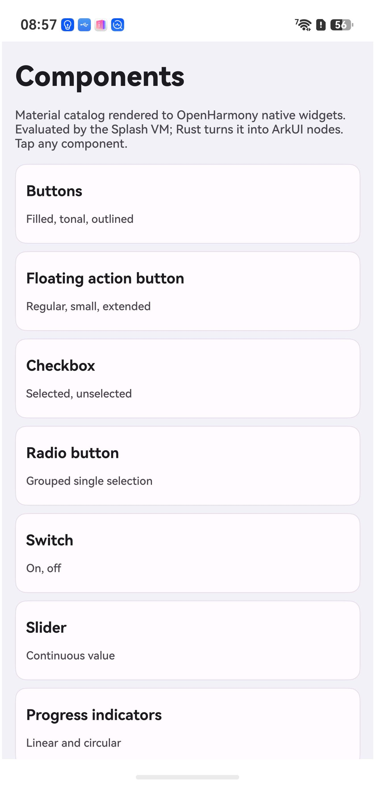

# Splash-OH

Render a UI tree to **OpenHarmony native ArkUI widgets from Rust**, with ArkTS
reduced to a single slot handover — and no makepad renderer involved.



Everything in that screenshot is a real ArkUI component (`ARKUI_NODE_TEXT`,
`ARKUI_NODE_BUTTON`, `TOGGLE`, `CHECKBOX`, `RADIO`, `SLIDER`, `PROGRESS`,
`TEXT_INPUT`, `DATE_PICKER`, `SCROLL`, `COLUMN`, `ROW`, `STACK`) created,
configured and mounted by Rust.

## Why

`octos-one`'s OpenHarmony port drives native widgets by calling ArkTS methods
over napi. Measured on a SUP-AL90, one round trip costs:

| phase | avg |
|---|---|
| `uv_queue_work` enqueue | 101 µs |
| **waiting for the JS event loop to pick it up** | **730 µs (70%)** |
| napi marshalling + ArkTS body | 220 µs |
| **total** | **~1.05 ms** |

The same operation on Android, via JNI + `runOnUiThread`, costs **46 µs** — 22×
cheaper, because Android posts and returns instead of blocking on a
single-threaded event loop.

One webview rectangle per frame can survive 1 ms. A *widget tree* cannot: every
`View`, `Label` and `Button` would pay it. So this repo asks whether the JS
thread can be removed from the path entirely.

It can.

## The one piece of ArkTS

```ts
@Entry @Component struct Index {
  private content: NodeContent = new NodeContent();
  aboutToAppear(): void { splash.mount(this.content); }   // the only ArkTS→native call
  build() { Column() { ContentSlot(this.content) }.width('100%').height('100%') }
}
```

After `mount()` returns, ArkTS is out of the loop. There are no per-widget and
no per-frame ArkTS calls.

## Layout

```
crates/splash-oh/
  build.rs              compiles the shim against the OHOS SDK, links ace_ndk
  src/arkui/shim.cpp    C++ over ArkUI_NativeNodeAPI_1 + compiler-computed enums
  src/arkui/mod.rs      safe Rust: Node, attributes, events, mounting
  src/catalog.rs        the widget catalog
  src/lib.rs            napi entry: NodeContent -> native tree
deveco/                 minimal HAP (one page, one ability)
```

## Build

```bash
source ~/ohos-sdk/env-deveco.sh
export OHOS_SDK_NATIVE="$OHOS_BASE_SDK_HOME/21/native"
cargo build --target aarch64-unknown-linux-ohos --release

cp target/aarch64-unknown-linux-ohos/release/libsplash_oh.so deveco/entry/libs/arm64-v8a/
cd deveco
export DEVECO_SDK_HOME="$DEVECO_HOME/sdk" NODE_HOME="$DEVECO_HOME/tools/node"
node "$DEVECO_HOME/tools/hvigor/bin/hvigorw.js" \
  assembleHap --mode module -p product=default -p buildMode=release --no-daemon
```

The `aarch64-unknown-linux-ohos` target ships in **nightly** only — see
`rust-toolchain.toml`.

## Three traps this repo already walked into

**1. Never hand-write the ArkUI enums.** `ArkUI_NodeAttributeType` is mostly
implicit (`NODE_HEIGHT,` with no `= N`) and the per-component blocks are
`1000 * ARKUI_NODE_X + n`. Transcribed by hand, `NODE_BORDER_WIDTH` came out 14
instead of 17 — which is `NODE_BLUR` — and the app died with
`SIGSEGV(SEGV_MAPERR)`. Parsing the header with a script was no better: implicit
values made the running counter drift (`ARKUI_NODE_COLUMN` → 27, actual 1006).
The fix is in `shim.cpp`: let the **compiler** evaluate them and export the
results as C globals that Rust reads.

**2. The SDK headers only compile as C++.** `native_type.h` uses bare `bool`;
`native_node.h` refers to `OH_PixelmapNative` without a `struct` tag. Both are
hard errors in C. Hence `shim.cpp`, not `shim.c`.

**3. `DEVECO_SDK_HOME` is DevEco's own `sdk/` directory** — not a versioned
symlink farm. Pointing it elsewhere yields `SDK component missing`.

## The DSL drives it

`assets/catalog.splash` **is** the app. The VM evaluates it at runtime and Rust
walks the resulting tree into ArkUI nodes — `fn`s, `for` loops, `while`,
arithmetic and `s.len()` all run on device:

```
fn argb(a, r, g, b) { return ((a * 256 + r) * 256 + g) * 256 + b }
let primary = argb(255, 103, 80, 164)

fn filled_button(label, tap) {
    return {t: "button", label: label, w: CARDW, h: 40, radius: 20,
            margin: 4, bg: primary, color: on_primary, tap: tap}
}

let chips = []
for c in [primary, secondary, tertiary, error, outline] { chips.push(swatch(c)) }
```

A node is `{t: "<type>", ...attrs, c: [children]}`. Plain data rather than
makepad's `Button{...}` component syntax, because that syntax resolves through
makepad's **widget registry** — exactly the coupling this repo avoids.

### Three things the DSL integration cost

- **Arrays are their own heap type.** `c: [...]` is a `ScriptArray`, not an
  object with a vec, so `as_object()` returns None and every subtree silently
  vanished. Use `as_array()` + `array_storage()`.
- **`0xFF6750A4` hex literals evaluate to 0**, which made every colour
  transparent — text and cards rendered invisible while default-coloured
  widgets looked fine. Hence `argb()`.
- **Native ArkUI nodes do not auto-size.** A `Text` with no width measures to
  zero and draws nothing; wrapped text needs its height computed, or it
  overlaps whatever follows.

## Backend mapping

The DSL is renderer-agnostic:
`makepad-script` (the Splash VM, ~52k lines) depends only on `error-log`,
`math`, `live-id`, `smallvec`, `regex` and `html` — **no platform, no draw, no
widgets**. It is already renderer-free, which
[ymote/Splash](https://github.com/ymote/Splash) demonstrates from the other
direction by vendoring the same VM with UI deliberately excluded.

So the remaining work is a backend trait, not a language extraction:

| Splash | ArkUI NDK | DOM |
|---|---|---|
| `View` | `STACK` / `ROW` / `COLUMN` / `FLEX` | `div` |
| `Label` | `TEXT` | `span` |
| `Button` | `BUTTON` | `button` |
| `TextInput` | `TEXT_INPUT` / `TEXT_AREA` | `input` |
| `Image` | `IMAGE` | `img` |
| `CheckBox` / `Slider` / `RadioButton` | `CHECKBOX` / `SLIDER` / `RADIO` | inputs |
| `PortalList` | `LIST` + `LIST_ITEM` | virtualized list |

Two parts do **not** port, and should fall back to an `XCOMPONENT` subtree with
makepad inside it:

- **Shaders** — `Pixel`/`Vertex`, `SDF`, `Instance`, `Texture`, gradients. There
  is no native equivalent.
- **`MapView`** — the nav card's 2.5D renderer.

And one known-hard mismatch: makepad's `Walk`/`Layout` (`Fill`/`Fit`, `flow:
Down/Right/Overlay`) is close to flexbox but not identical, so cards authored
against makepad's exact behaviour will need review, not just a backend swap.

## Status

Working: native tree creation, attributes, containers, scrolling, event
registration, mounting, and the catalog on a real device (HarmonyOS 6.1,
SUP-AL90).

Not done yet: the event *receiver* is registered but callbacks are not yet
dispatched back into Rust handlers, there is no diffing (the tree is built
once), and layout is explicit — the DSL sizes every leaf because ArkUI native
nodes do not measure themselves.
